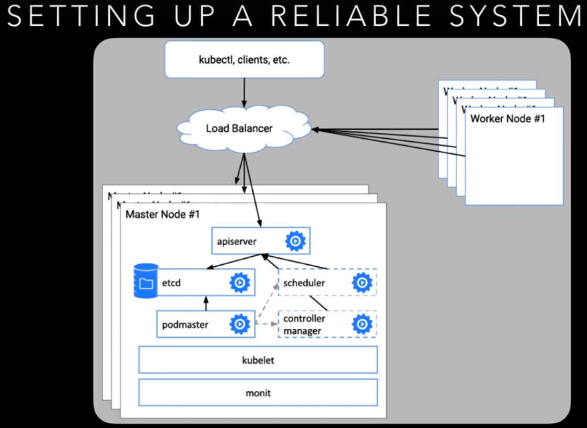
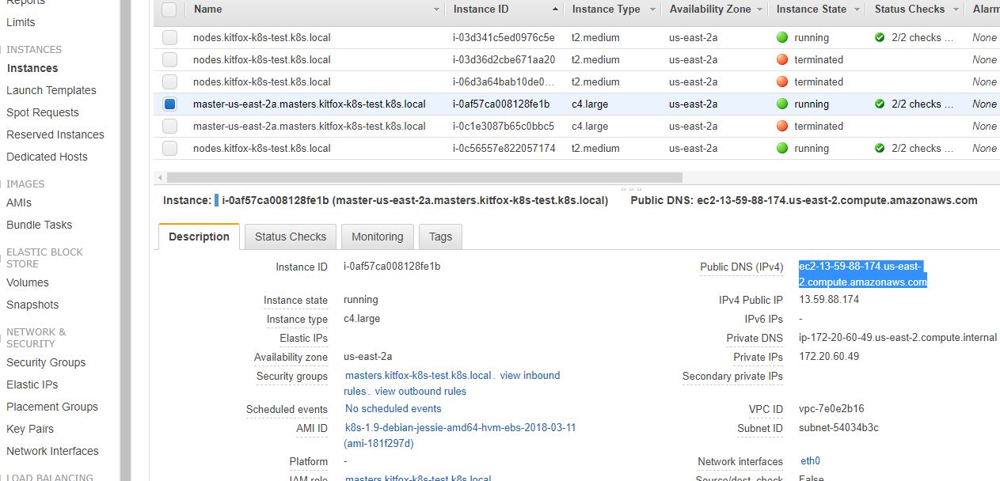

# k8s-devops-udemy

https://github.com/jleetutorial/kubernetes-demo

Kubernetes:
https://kubernetes.io/docs/imported/release/notes/

Cheat sheet:
https://kubernetes.io/docs/reference/kubectl/cheatsheet/

References:
https://kubernetes.io/docs/reference/generated/kubectl/kubectl-commands

Notes:
1. '---' is used for separating documents. It allows us to place multiple things in a single file - e.g. services, deployments, etc. We could have made separate documents - one for service, one for deployment, but the '---' allows us placing them in a single file.

2. For deployments we use 'apiVersion: apps/v1', for everything else we use 'apiVersion: v1'

3. 'kubectl create' can be used only for creating new deployments; 'kubectl apply' can be used for both creating and updating deployments. Other than that they're identical.

Important:
ALWAYS use `minikube stop` before reboot
https://github.com/kubernetes/minikube/issues/2561

## Setup

Facebook: https://www.facebook.com/groups/1911219079195863/

### downloads and install

Minikube: https://github.com/kubernetes/minikube/releases

Kubectl: https://kubernetes.io/docs/imported/release/notes/

Or:  
```https://storage.googleapis.com/kubernetes-release/release/<VERSION TAG>/bin/<OS>/<ARCH>/kubectl```

Replace the `<VERSION TAG>`, `<OS>`, and `<ARCH>` with the values appropriate for your system.   
`<VERSION TAG>` is the tagged release such as v1.4.1.   
The `<OS>` can be values such as darwin (for mac), linux, and windows.  
The `<ARCH>` possible values are 386 and amd64.

EX: https://storage.googleapis.com/kubernetes-release/release/v1.10.0/bin/windows/amd64/kubectl.exe

### hello-minikube quickstart
https://kubernetes.io/docs/setup/minikube/

`PS> kubectl run hello-minikube --image=k8s.gcr.io/echoserver:1.10 --port=8080`  
`PS> kubectl expose deployment hello-minikube --type=NodePort`

### Commands utilities

```
PS> kubectl get pods
PS> kubectl get pods [pod name]
PS> kubectl expose <type name> <identifier/name> [--port=external port] [--target-port=container-port [--type=service-type]
PS> kubectl port-forward <pod name> [LOCAL_PORT:]REMOTE_PORT]
PS> kubectl attach <pod name> -c <container>
PS> kubectl exec [-it] <pod name> [-c CONTAINER] -- COMMAND [args…]
PS> kubectl label [--overwrite] <type> KEY_1=VAL_1 ….
PS> kubectl run <name> --image=image
```

### Commands scaling
```
PS> kubectl scale --replicas=4 deployment/tomcat-deployment 
PS> kubectl expose deployment tomcat-deployment --type=NodePort
PS> kubectl expose deployment tomcat-deployment --type=LoadBalancer --port=8080 --target-port=8080 --name tomcat-load-balancer
PS> kubectl describe services tomcat-load-balancer
```
- LoadBalancer will expose a single port to the outside world connecting to multiple replicas in a deployment.

### Commands deployments
```
PS> kubectl get deployments
PS> kubectl rollout status
PS> kubectl set image deployment/[metadata name] [container name]=[image name]:[version]
PS> kubectl rollout history
```

### Readiness probes lecture 19.

- see Health Checks

### Commands dashboard

```
PS> kubectl proxy
PS> kubectl create -f https://raw.githubusercontent.com/kubernetes/dashboard/master/src/deploy/recommended/kubernetes-dashboard.yaml
```
I have `PS> kubectl proxy` running in the background and I tried to open that link, and I can see this error:

Error: 'tls: oversized record received with length 20527' 
Trying to reach: 'https://100.116.93.11:9090/'  
This works though: http://localhost:8001/api/v1/namespaces/kube-system/services/kubernetes-dashboard/proxy

### Exercise

-Problem with `EXTERNAL-IP <pending>`  
It looks like you are using a custom Kubernetes Cluster (using minikube, kubeadm or the like).  
In this case, there is no LoadBalancer integrated (unlike AWS or Google Cloud).  
With this default setup, you can only use NodePort (more info here: https://kubernetes.io/docs/concepts/services-networking/service/#type-nodeport) or an Ingress Controller. With the Ingress Controller you can setup a domain name which maps to your pod (more information here: https://kubernetes.io/docs/concepts/services-networking/ingress/#ingress-controllers)

### apply and updating deployment with apply

Using `PS> kubectl apply` to create the resource is not a workaround. It is intended usage.
http://kubernetes.io/docs/user-guide/kubectl/kubectl_apply/

Using create instead, without --save-config, is incorrect usage. I recommend sending the bug report / feature request to helm.

### Secrets

```
PS> kubectl create secret generic db-user-pass --from-file=./username.txt --from-file=./password.txt
PS> kubectl create secret generic mysql-pass --from-literal=password=YOUR_PASSWORD
```

### Monitoring & Metrics

Heapster: (CNCF) collect data on all pods talking Kubelets and feed InfluxDB 
InfluxDB: 
Grafana: Visual tool

```
PS> minikube addons enable heapster
//check status 
PS> kubectl get pods --namespace=kube-system
//access Grafana Dashboard 
PS> minikube addons open heapster 
```

- login with admin:admin

### Namespaces & Resource Limits

- devide ressources across multiple users or teams.
- RessourceQuotas can limit ressources when assigned to a Namespace
    - CPU
    - Memory
    - Storage
- 200m CPU = 20% usage

```
PS> kubectl create namespace <namespace name>
PS> kubectl get namespace
PS> kubectl create namespace cpu-limited-tomcat
PS> kubectl create -f ./cpu-limits.yaml —namespace=cpu-limited-tomcat (from the GitHub repo directory for this lecture)
PS> kubectl apply -f ./tomcat-deployment.yaml —namespace=cpu-limited-tomcat (from the GitHub repo directory for this lecture)
PS> kubectl describe deployment tomcat-deployment —namespace=cpu-limited-tomcat
```    

### Auto-Scaling

- For test : Artificially limit CPU on wordpress. (See Auto-Scaling yaml)

```
kubectl autoscale deployment wordpress --cpu-percent=50 --min=1 --max=5
```

Run busybox and start load.
```
kubectl run -i --tty load-generator --image=busybox /bin/sh
while true; do wget -q -O- http://wordpress.default.svc.cluster.local; done
```

Get status
```
kubectl get hpa
```

- NOTE
  
1. `minikube` no longer has `metrics-server` enabled by default. To enable it:

    ```
    minikube service list
    minikube addons enable metrics-server
    kubectl get pod --namespace=kube-system
    ``` 

2. Wordpress redirects to canonical name by default.  
Unfortunately, it believes that you should be using port 3xxxx so it redirects to that.  
In the actual container, nothing is listening to that port.  
You could disable redirection by adding: `remove_action('template_redirect', 'redirect_canonical');` to `wp-config.php`.  
However, I think it's much easier to just generate generate load locally (only tested on Linux, YMMV):

    ```
    while true; do wget -q -O -S $(minikube service wordpress --url); done
    ``` 

### Auditing

Issues:  
https://github.com/kubernetes/minikube/issues/1609
https://github.com/kubernetes/minikube/issues/2934

Api server code:  
https://github.com/kubernetes/minikube/tree/v0.28.0/vendor/k8s.io

Doc:  
https://kubernetes.io/docs/tasks/debug-application-cluster/audit/

### High Availability



- AWS access Key -> Name (top right) -> My Security Credentials -> Access keys -> Create new

- KOPS: Easyest is to install Ubuntu from https://www.osboxes.org/
    - install VirtualBox Extension File -> Preferences -> Extensions -> Add new
    - Once booted: Devices -> Insert Guest Additions CD Image... -> Install
    - run apt-get update and install kubectl

- Create bucket    
```aws s3api create-bucket --bucket kitfox-k8s-test-bucket --region us-east-2 --create-bucket-configuration LocationConstraint=us-east-2```

- Create cluster
    - Double verify ~/id_rsa.pub. if not use `ssh-keygen` with defaults.  
    - zones: https://docs.aws.amazon.com/AWSEC2/latest/UserGuide/using-regions-availability-zones.html
    
        ```
        export KOPS_STATE_STORE=s3://kitfox-k8s-test-bucket
        kops create cluster kitfox-k8s-test.k8s.local --zones us-east-2a --yes
        ```
        
        ```
        kops delete cluster kitfox-k8s-test.k8s.local --yes
        ```
        And try again.
        
- After creation suggestions:
    * validate cluster: `kops validate cluster`
    * list nodes: `kubectl get nodes --show-labels`
    * ssh to the master: `ssh -i ~/.ssh/id_rsa admin@api.kitfox-k8s-test.k8s.local`  
    You will have to get the public DNS form console:
    
    Ex: `ssh -i ~/.ssh/id_rsa admin@ec2-13-59-88-174.us-east-2.compute.amazonaws.com`
    * the admin user is specific to Debian. If not using Debian please use the appropriate user based on your OS.
    * read about installing addons at: https://github.com/kubernetes/kops/blob/master/docs/addons.md.

### High Availability : Multiple Masters

- Create HA cluster
    ```
    export KOPS_STATE_STORE=s3://kitfox-k8s-test-bucket
    kops create cluster kitfox-k8s-test.k8s.local --zones us-east-2a,us-east-2b,us-east-2c --node-count 3 --master-zones us-east-2a,us-east-2b,us-east-2c --yes 
    ```

- Run yaml in Setting up High Availability

### Volumes on AWS

- use small cluster
- deploy mysql and wordpress with yaml in Kubernetes in Production/Volumes on AWS
- Checks
    ```
    kubectl describe pv (persistentvolumes shortcut)
    kubectl describe service wordpress
    ```
    - LoadBalancer Ingresses = public url.
    
### Books

http://www.level-up.one/devops-pdf-book